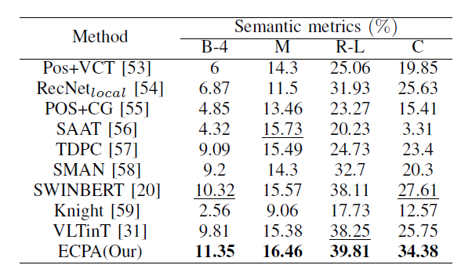

# ECPA_Emotional_Video_Captioning
Human-centric Emotional Video Captioning (H-EVC) aims to generate fine-grained, emotion-related sentences for human-based videos, enhancing human emotions and facilitating human-computer emotional interaction.

# Requirements
We use [Docker image of SwinBert](https://hub.docker.com/r/linjieli222/videocap_torch1.7/tags) for easier reproduction. Please install the following:
Nvidia driver (418+),
Docker (19.03+),
nvidia-container-toolkit.
We only support Linux with NVIDIA GPUs. We test on Ubuntu 18.04 and RTX 3090 Ti card. 
# Download
## Create folders that store pretrained models, datasets, and predictions.
<div style="background-color: #f6f8fa; padding: 10px; border-radius: 5px;">

```bash
export REPO_DIR=$PWD
mkdir -p $REPO_DIR/models  # pre-trained models
mkdir -p $REPO_DIR/datasets  # datasets
mkdir -p $REPO_DIR/predictions  # prediction outputs
```
## Pretrained models.

Our pre-trained models can be downloaded with the following command.
<div style="background-color: #f6f8fa; padding: 10px; border-radius: 5px;">

```bash
cd $REPO_DIR
bash scripts/download_models.sh
```
The script will download our models that are trained for VATEX, MSRVTT, MSVD, TVC and YouCook2, respectively. It will also download our training logs and output predictions.
## Pretrained Video Swin Transformers.
To run our code smoothly, please visit [Video Swin Transformer](https://github.com/SwinTransformer/Video-Swin-Transformer) to download pre-trained weights models.
Download swin_base_patch244_window877_kinetics*_22k.pth, and place them under ${REPO_DIR}/models/video_swin_transformer directory.
# Quick Demo
We provide a demo to run end-to-end inference on the test video. Our inference code will take a human-based video as input and generate an emotional video caption. [MAFW](https://example.com/data.zip) | [EmoVidCap](https://example.com/checkpoint.zip)| [best-checkpoint](https://pan.baidu.com/s/1wxl6aSXOaOqv_4GbELWRlQ?pwd=sqdg)

# Evaluation 
<div style="background-color: #f6f8fa; padding: 10px; border-radius: 5px;">

```bash
EVAL_DIR='./models/table1/MAFW/best-checkpoint/'
CHECKPOINT='./models/table1/MAFW/best-checkpoint/model.bin'
VIDEO='./docs/G0mjFqytJt4_000152_000162.mp4'
CUDA_VISIBLE_DEVICES=0 python src/tasks/ECPA_inference.py \
       --resume_checkpoint $CHECKPOINT  \
       --eval_model_dir $EVAL_DIR \
       --test_video_fname $VIDEO \
       --do_lower_case \
       --do_test 
```    

## Evaluation results
Compared with other methods on the MAFW dataset. The best results are in bold, and the second is underlined.


## ⭐ Demos
### Captions generated by our ECPA with the ground truth (GT) on the MAFW and EmVidCap datasets, respectively. 
<table>
  <tr>
    <td style="text-align: center; padding: 10px; display: flex; flex-direction: column; align-items: center;">
      
      <div style="background-color: #f6f8fa; padding: 10px; border-radius: 8px; margin-top: 10px; width: 300px; min-height: 220px; display: flex; flex-direction: column; justify-content: center;">
        <p style="word-wrap: break-word; margin: 0; text-align: center;"><strong>GT</strong>: A woman crosses her arms and talks to the other person, then takes away the plate that places on the couch. The frown and the wrinkled nose. <br><strong>ECPA</strong>: a woman speaks to the person in front of her. the frown and the wrinkled
nose.</p>
      </div>
    </td>
    <td style="text-align: center; padding: 10px; display: flex; flex-direction: column; align-items: center;">
      
      <div style="background-color: #f6f8fa; padding: 10px; border-radius: 8px; margin-top: 10px; width: 300px; min-height: 220px; display: flex; flex-direction: column; justify-content: center;">
        <p style="word-wrap: break-word; margin: 0; text-align: center;"><strong>GT</strong>: A man turns his head to look at someone, chews something, and sighs. The frown and the slight open mouth. <br><strong>ECPA</strong>: a man looks at the other and sighs. the frown and the slightly open mouth.</p>
      </div>
    </td>
  </tr>
</table>
<table>
  <tr>
    <td style="text-align: center; padding: 10px; display: flex; flex-direction: column; align-items: center;">
      
      <div style="background-color: #f6f8fa; padding: 10px; border-radius: 8px; margin-top: 10px; width: 300px; min-height: 220px; display: flex; flex-direction: column; justify-content: center;">
        <p style="word-wrap: break-word; margin: 0; text-align: center;"><strong>GT</strong>: A man talks to the other side of his head. The frown, the wrinkled nose and the slightly open mouth.<br> <strong>ECPA</strong>: a man looks at the other side of his head. the frown and the slightly compressed lips.</p>
      </div>
    </td>
    <td style="text-align: center; padding: 10px; display: flex; flex-direction: column; align-items: center;">
      
      <div style="background-color: #f6f8fa; padding: 10px; border-radius: 8px; margin-top: 10px; width: 300px; min-height: 220px; display: flex; flex-direction: column; justify-content: center;">
        <p style="word-wrap: break-word; margin: 0; text-align: center;"><strong>GT</strong>: A man was reading a script while another man was putting small animals on him to astonish him. <br><strong>ECPA</strong>: to the surprise, the man was reading a script while another man was putting small animals on him.</p>
      </div>
    </td>
  </tr>
</table>

<table>
  <tr>
    <td style="text-align: center; padding: 10px; display: flex; flex-direction: column; align-items: center;">
      
      <div style="background-color: #f6f8fa; padding: 10px; border-radius: 8px; margin-top: 10px; width: 300px; min-height: 220px; display: flex; flex-direction: column; justify-content: center;">
        <p style="word-wrap: break-word; margin: 0; text-align: center;">
          <strong>GT</strong>: A man looks at his laptop and speaks. The frown, the wrinkled nose and the slightly open mouth. <br><strong>ECPA</strong>: a man sits in the chair and talks to the other. The marked frown and the wrinkled nose.
        </p>
      </div>
    </td>
    <td style="text-align: center; padding: 10px; display: flex; flex-direction: column; align-items: center;">
      
      <div style="background-color: #f6f8fa; padding: 10px; border-radius: 8px; margin-top: 10px; width: 300px; min-height: 220px; display: flex; flex-direction: column; justify-content: center;">
        <p style="word-wrap: break-word; margin: 0; text-align: center;">
          <strong>GT</strong>: A man speaks to the camera. The <span style="color: green;">open mouth</span> and the wide eyes. <br><strong>ECPA</strong>: a man speaks excitedly. The wide eyes and the <span style="color: skyblue;">open mouth</span>.
        </p>
      </div>
    </td>
  </tr>
</table>


